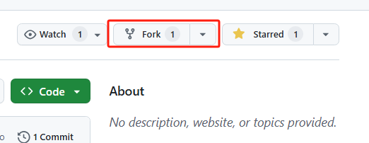
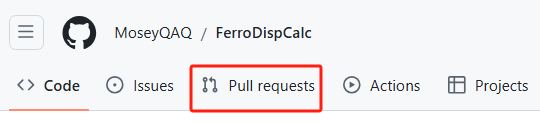
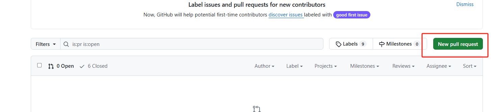
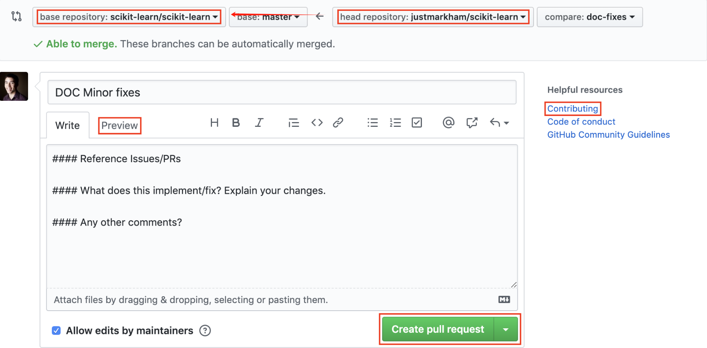

# How to Contribute

__Author__: Denan LI

We appreciate contributions to this project! Follow the steps below to get started.

## 1. Forking the repository

The repository (repo) web URL: <https://github.com/sliutheorygroup/sliutheorygroup.github.io>

Fork the repository by clicking on the "Fork" button on the top right of the project page. This will create a copy of the repository under your GitHub account.



## 2. Clone the Repo

After forking the repository, clone your forked repo to your local machine:

```bash
git clone https://github.com/your-username/repo-name.git
```

Replace `your-username` with your GitHub username and `repo-name` with the name of the repository.

## 3. Create a New Branch

Create a new branch to work on your changes. It’s good practice to name the branch according to the feature or fix you're working on:

```bash
git checkout -b your-branch-name
```

## 4. Make Your Modifications

Make the necessary changes to the wiki.

## 5. Stage, Commit, and Push Changes

Once you’ve made your changes, stage the files and create a commit:

```bash
git add . # stage the files
git commit -m "Descript what you have done"  # create a commit
```

Then push the changes to your remote branch:

```bash
git push origin your-branch-name # push the changes to remote 
```

## 6. Submit a Pull Request (PR)

Pull Request (PR) is a proposal to merge your code to the parent repo.

Once the changes are pushed to your forked repository, submit a PR to the original repository:

* Go to the original repository's githug webpage.
* Click the "Pull Requests" tab.



* Click "New Pull Request."



* Select the branch you want to merge from (your forked repository) and the branch you want to merge into (the original repository's main branch).Provide a clear description of the changes you've made and submit the PR.



* After review, your modifications will be merged into the origin repo.

## 7. Delete the Local Branch

After your PR has been merged, you can safely delete the local branch:

```bash
git checkout main
git branch -d your-branch-name
```

## 8. Useful Resources

* Github SSH设置：<https://zhuanlan.zhihu.com/p/688103044>
* Github 提交PR：<https://zhuanlan.zhihu.com/p/584834288>
* git基本教程：<https://www.runoob.com/git/git-tutorial.html>

Your contribution is greatly appreciated. If you have any questions, feel free to ask in the repository's issue tracker.